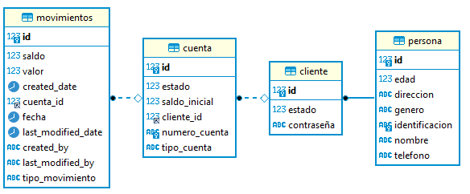

# Challenge Devsu

### Install

To run the project execute the following instruction:

````
docker-compose up -d
````

To verify that all the services of this project have been carried out correctly
````
docker ps
````

To verify the logs;
````
docker logs [name_container]
````

To download the containers, execute the following instruction
````
docker-compose down -v
````

### Docs
Entity relationship diagram of the proposed solution:


### Collections
Import postman collection to verify endpoints:
- [Account](collections/Account.postman_collection.json)
- [Client](collections/Client.postman_collection.json)
- [Movements](collections/Movements.postman_collection.json)

### Scripts Database

- [script](database/dump-devsu-202401122218.sql)


### Author

- [Luis Chica Moncayo](https://github.com/LuisChica18)